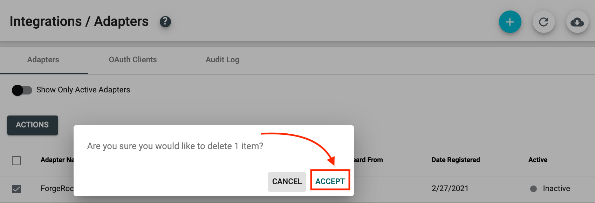

# TruU ForgeRock Plugin Setup Guide

## Introduction
This deployment guide details how to configure the TruU ForgeRock Plugin with ForgeRock for
biometric based identity verification to federated resources. The TruU ForgeRock Plugin
enables ForgeRock to communicate with your TruU Identity Server(s) and the TruU Identity
Platform in order to provide authentication decisions to ForgeRock applications.

At a high level, you will perform the following steps to deploy a TruU ForgeRock Plugin, (the
detailed instructions are in the ensuing pages of this guide):

1. Creating a TruU ForgeRock Plugin from the TruU Admin Console
2. Deploying TruU Plugins in the ForgeRock server
3. Managing a TruU ForgeRock Plugin in the TruU Admin Console

## System Requirements

#### ForgeRock Version:

* ForgeRock Access Management 6.5 or 7

#### Firewall Ports:
The TruU ForgeRock Plugin communicates with the TruU Identity Server for authentication
decisions and to validate OAuth tokens used for authorizing communication between all TruU
software deployed in your organization. Open the required firewall ports below to enable
communication with your TruU infrastructure.

|Service|Port|Source|Destination|Description & Endpoint|
|---|---|---|---|---|
|HTTPS|443|ForgeRock Server|TruU Identity Server Load-Balancer|**Description**:Used for communication between your ForgeRock server and your TruU Identity Server load-balancer. The connection enables the TruU Identity Server to provide access decisions (e.g. allow or deny application access) on behalf of ForgeRock after TruU has verified the user. **Endpoint**:The TruU Identity Server can accept incoming requests from ForgeRock server over port 443.

## Creating a TruU ForgeRock Plugin Adapter

### Overview
The TruU ForgeRock Plugin enables integration with third-party resources that support the  protocol. When configured for ForgeRock, an Administrator can delegate authentication of  ForgeRock protected resources to TruU where TruU validates the identity of users via  biometrics.

### Configuration

1. Log into your TruU Admin Console and navigate to **'Settings' > 'Integrations'** tab.

2. Next, navigate to ‘Adapters’ tab, then click (+) to create a new TruU adapter instance.

3. Select the **'Single Sign On'** adapter, then select the **'ForgeRock'** adapter type from the  dropdown menu. Enter a unique name for the adapter (e.g. ForgeRock), confirm your  Identity Server URL, then confirm your FIDO origin. Click **'Create'**. If prompted, select the appropriate TruU console administrator role(s) to manage the adapter. Click **'Apply'** to save the configuration and select both checkboxes in order to download all files and agree to the EULA. Finally click **'Download and Finish'** to download a .ZIP file containing the plugin and a configuration file to be used within the  ForgeRock administration console.

---

---

## Deploying TruU ForgeRock Plugin
The TruU ForgeRock Plugin is a custom Java application that runs on your ForgeRock server. The plugin enables the TruU Identity Server to provide authentication decisions for any ForgeRock application using the plugin.

### Configuration

1. Unzip the TruU ForgeRock Plugin files and copy files to the ForgeRock directory below:

		$ unzip truu-forgerock-adapter-XX.XX.zip
		$ cp truu-identity-XX.XX-nodes.jar <YourForgeRockInstallFolder>/tomcat/webapps/openam/WEB-INF/lib/

2. Restart the ForgeRock server to initialize the TruU ForgeRock Plugin.

## Configuring TruU ForgeRock Plugin

### Overview
ForgeRock plugins enable specific authentication flows to one or more federated applications using the plugin. An Administrator can configure one or more federated applications with a TruU Plugin in order to enforce an authentication flow that requires a user to provide their identity using biometrics or FluidID (behavior).

### User Directory Options
TruU supports the following directories and user attributes:

* Active Directory (`userPrincipalName`)  
* Azure Active Directory (`userPrincipalName`)  
* Okta (`login`)

Once a user completes TruU authentication, the TruU Identity Server will return the aforementioned user attribute to ForgeRock Access Management. We recommend sharing the same user directory between Access Management and your TruU Identity Server, or using ForgeRock Identity Management to reconcile identities between directories.

### Configuration

#### Automatic Tree Import
The following steps describe how a ForgeRock Access Management administrator can import the recommended TruU authentication tree using the [truu-identity.json](truu-identity.json) template. You will need the Access Management utility `amtree.sh`, which can be downloaded from [https://github.com/vscheuber/AM-treetool](https://github.com/vscheuber/AM-treetool).

1. Copy the [truu-identity.json](truu-identity.json) template (included in the `truu-forgerock-adapter-XX.XX.zip` package) to the directory from which you will run the `amtree.sh` tool.
2. Run the following command, replacing the Access Management hostname and administrator credentials with values appropriate in your environment:

		$ ./amtree.sh -h http://openam.example.com:8080/openam -u amadmin -p password -i TruuAuthentication -f truu-identity.json

3. Log into your Access Management console, navigate to the imported tree, and update the configuration values for the **TruU Identity Request Node** (enter the Identity Server URL, client ID and client secret) and the **TruU WebAuthn Node** (enter the relying party origin).

#### Manual Tree Creation
The following steps describe how an administrator within ForgeRock Access Management can create a tree for TruU authentication.

1. Log into your ForgeRock Admin Portal and navigate to **'Authentication' > 'Trees'** and create a new tree for TruU.

2. Create the following tree for TruU:

3. Complete the required ForgeRock fields using the configuration file downloaded from your TruU Admin Console.

|TruU Identity Server Request Node|Description|
|---|---|
|Identity Timeout|Identity request timeout in seconds (60 second default)|
|URL|Identity Server load-balanced URL (refer to TruU configuration file)|
|Client ID|Refer to TruU configuration file|
|Client Secret|Refer to TruU configuration file|

|TruU Authentication Node|Description|
|---|---|
|Polling Period|How frequently the ForgeRock server will query the TruU Identity Server for an identity request status (2 second default)|
|Waiting Timeout|Time after which an outstanding identity request will automatically be denied (60 second default)|
|Waiting Message|Message displayed in web browser to assist users in completing the identity request|

|TruU QR Code Node|Description|
|---|---|
|Android Deep Link URL|URL for deep-linking into TruU Fluid Identity Android app (refer to TruU configuration file, `truu://` by default)|
|iOS Deep Link URL|URL for deep-linking into TruU Fluid Identity iOS app (refer to TruU configuration file, `https://app.mobilelink.truu.ai` by default)|
|Polling Period|How frequently the ForgeRock server will query the TruU Identity Server for an identity request status (2 second default)|
|Waiting Timeout|Time after which an outstanding identity request will automatically be denied (60 second default)|
|Desktop Message|Message displayed in desktop web browser users to assist in completing the identity request|
|Mobile Message|Message displayed in mobile users to assist in completing the identity request|
|Cookie Lifetime|Number of days for which a cookie (if the user opts to "Remember Me") will be stored; allows users to bypass QR re-scan or FIDO2 username re-entry and instead receive an automatic push notification (30 days by default)|
|Exitable|Optional toggle to allow users to cancel a TruU identity request|
|Exit Message|Action prompt displayed to users when "Exitable" toggle is enabled that allows a user to cancel an identity request|

|TruU Username Collector Node with Cookie Option|Description|
|---|---|
|Cookie Lifetime|Number of days for which a cookie (if the user opts to "Remember Me") will be stored; allows users to bypass QR re-scan or FIDO2 username re-entry and instead receive an automatic push notification (30 days by default)|

|TruU WebAuthn|Description|
|---|---|
|Relying Party|Relying party origin for FIDO2 authentication (refer to TruU configuration)|
|Waiting Message|Message displayed while waiting for user response|

|TruU Data Store Decision Node|
|---|
|No configuration required (this node enables password-less user lookups against the directory configured in your ForgeRock environment)|

***Standard ForgeRock Authentication Nodes***

|Choice Collector|Description|
|---|---|
|Choices|`QR Code` and `FIDO Token` (suggested choice names)|
|Default Choice|`QR Code` (suggested default choice)|
|Prompt|"Please Select Your Authentication Method" (suggested user prompt)|

4. Click **'Save'** to complete.

## Managing TruU ForgeRock Adapter

1. To edit an existing TruU ForgeRock Plugin adapter in your TruU Admin Console, click on the adapter instance. Once clicked, you can edit the adapter name, change the FIDO Origin and/or toggle the adapter from **'Active'** to **'Inactive'**.

2. To delete an existing TruU ForgeRock Plugin adapter in your TruU Admin Console, click on the adapter instance and then change the **'Active'** toggle to **'Inactive'**. Click **'Save'**.

3. Disable the **'Show Only Active Adapters'** toggle to display the inactive ForgeRock adapter.

4. Click the checkbox next to the inactive ForgeRock adapter and click **'Delete'** from the **'Actions'** menu.

5. Click **'Accept'** to delete the ForgeRock adapter.

